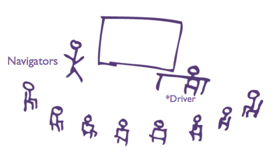
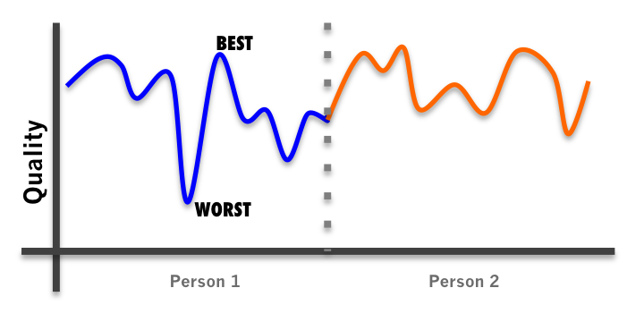
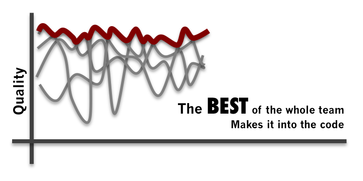

# What is Mob Programming?

> *"All the brilliant people working on the same thing, at the same time, in the same space, on the same computer." -- Woody Zuill (the discoverer of Mob Programming)*

Mob Programming is a style of programming in which the entire team sits together and works on a single task at a time. Teams that have worked this way have found that many of the problems that plague normal development have just melted away, possibly because communication and learning goes way up. Teams also find that the quality of their code increases. They find their capacity to create increases. However, the best part of all is that teams end up happier and more cohesive.

In mob programming, there is a driver, who is the person at the keyboard. Many people thinks this means having five people watch one person work. This is not mob programming. In fact, mobbing has the rule that the driver is not allowed to think while at the keyboard. This means that you can't have people just watching the person type. Mobbing is about the entire team collaborating together. Having a single computer and driver allows everybody's thoughts and insights to be captured for the task at hand.

## Why would you have 5-8 people working on one thing?

A lot of people think that it must inefficient and wasteful to have your entire team working on one problem. Couldn't you get more out them if you divide and conquer? The answer is: No. It's better to think of this in a completely different fashion.

Instead of thinking how can I get the most out of my team, with mob programming we ask **how can I get the best out of my team?** This process was discovered by Woody Zuill and his team at Hunter Industries through the process of constantly paying attention to what they were doing, and doing **more** of the things that were working.

Maybe you've had the experience where the team came together and swarmed over a particularly tough problem. By working together as a team, the swarm might have been able to resolve that problem. We've talked to many people who have had this experience. The big difference is that after having success working in this manner, most teams say "Problem solved, let's go back to normal". Mobbing says "We were very high performing, how can we do more of that?".

## Getting the best out of your team

All of us have good and bad skills areas and moments. When you work by yourself, both your best and your worst makes it into the code. When you have a team of people working together but separately, their best and their worst makes it into the code.

In the end it's only what makes it into the code that actually matters.

When you work as a mob, everybody still has their highs and lows. However, this is not what makes it into the code. What makes it into the code is only the highest points. This can be particularly empowering for team members whose programming skill might not be the best. We have found that on many teams, some of the best ideas come from members that trouble turning those insights into production code. Left by themselves, those insights die. In the mob, they flourish.

## The benefits of high communication

Very often people make mistakes. Maybe we misunderstood a detail of a requirement. Maybe your understanding of small is different than my understanding of small. Or maybe there is just an aspect that was left out and forgotten. If I make this mistake on Monday morning but I don't find out about it until Thursday afternoon, I am going to compound that mistake all week. Worse, because I've spent so much effort, I will become defensive of my work and try to protect my mistake.

When we work in a mob, many of these mistakes are detected the moment they occur. Mainly because somebody on the team has that knowledge. Sometimes simply because someone on the team is willing to ask a question.

There are tremendous benefits to this just-in-time knowledge. And unfortunately, the cost of the delays is mainly hidden and does not show up on anybody's accounting sheet. If the hours programmers waste because of gaps in knowledge or understanding were actually accounted for, there would be much less resistance to mob programming. 

In other words, everyone thinks that five people working by themselves means that everyone is working well independently. This is rarely the case.

Imagine a jazz band. Are you going to get better music if you put everyone together and have them play a song or if you send them off to record separate pieces and then try to integrate them later?
