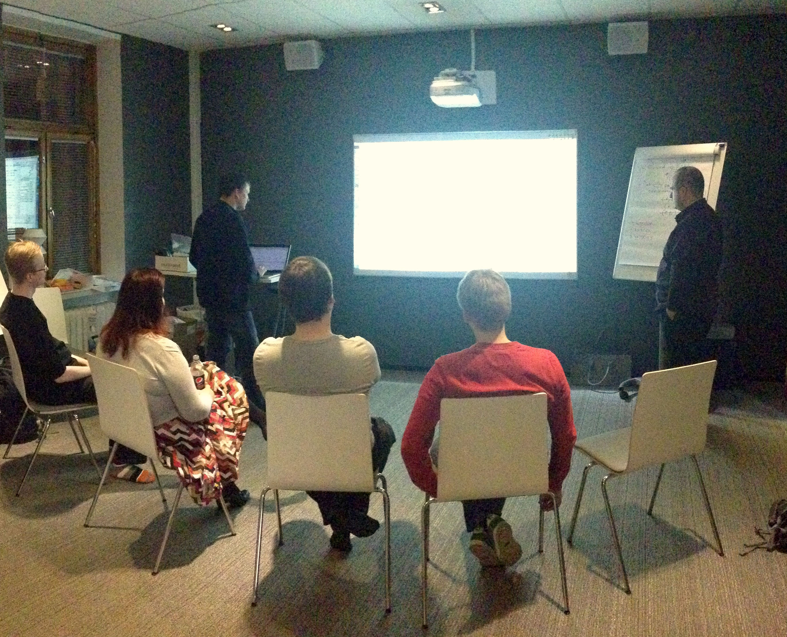

# Working in Your First Mob

## Heuristic

If everything is going right, rotation will not disrupt the direction which the mob is going.

## Preparing the navigator

Part of having a good mobbing experience is being able to have a clear direction that is shared throughout the team. A few little tricks can be done to enable this to happen as it is not a habit most people have acquired yet.

Ask the navigator what they are going to do. Here's some examples of when a navigator has a clear direction versus when they are lost.

Lost:

**Q**: <i> "What are you going to do?"</i>    
**A**: <i> "I don't know."</i>     
**A**: <i> "Something with the test."</i>     
**A**: <i> "Get it to work."</i>     
**A**: <i> "The next scenario."</i>    
**A**: (stares blankly)

Has direction:

**Q**: <i> "What are you going to do?"</i>  
**A**: <i> "The code does not compile. We need to fix that."</i>  
**A**: <i> "We need to write the test for handling positive numbers."</i>  
**A**: <i> "I'd like to give that paragraph a better name."</i>  
**A**: <i> "We haven't checked in the code for a while, let's do that."</i>  

Sometimes you can get to a direction through a series of questions. For example:

**Q**: <i> "What are you going to do next?"</i>  
**A**: <i> "I don't know."</i>   
**Q**: <i> "Does the code work?"</i>  
**A**: <i> "No."</i>  
**Q**: <i> "Why?"</i>  
**A**: <i> "It doesn't compile."</i>   
**Q**: <i> "Why not?"</i>  
**A**: <i> "The class does not exist."</i>   
**Q**: <i> "What are you going to do next?"</i>  
**A**: <i> "We need to create the class."</i>  

### Examples

If you are working on a task or doing test-first development, it is very useful to have an example written on a whiteboard. The examples should be very simple, and only show one path at a time. This means of you can **not** use conditional words like "or", "if", "depending", or "maybe". If there is an example, it might take many turns before its finished, and having it on the board will give guidance for the whole team on what they need to do as each new navigator takes over and continues on the task.

Examples should make you feel like the person telling the example actually did the thing yesterday. Imagine a teenager talking to thier parent.   
<i>"What did you do last night?"</i>   
<i>"I went to a friends house and played Scrabble."</i>   
<i>"How did the game go?"</i>   
<i>"Well, if I had played words on a triple letter score, then they would score three times."</i>   
<i>"Oh, who won?"</i>   
<i>"The person with the highest score."</i>  

Does this sound like the teenager actually played Scrabble last night? This is what bad examples feels  like. You want a good **concrete** example.   
<i>"How did the game go?"</i>   
<i>"There was three players: me, Jennifer and Samantha. Samantha went first playing the word 'again' for 7 points. ... Jennifer ended up winning with 297 points."</i>  

Now you have an example that you can turn into code.  

These examples should be drawn on a whiteboard and they will help everybody in the team be on the same page. The really important part here is that everyone is on the same page, working from the same example.

## Consume first

It is extremely beneficial to use the "consume first" style of programming as opposed to more common "build up" style of programming. This allows the group to have a clear idea on where we are going and what is needed. Let's look at two examples to show how this works.

### Build up example

    public int x;
    public int y;
**Q**: What do you need to next?  
**A**: It's almost impossible to know what to do next right now!

The navigator had a plan, but unless you are in their head, you can't continue it on. And it is hard to check that what they were doing is correct.

### Consume first example

    Point p = new Point(10, 20);
**Q**: What do you need to next?  
**A**: Notice that Point does not compile yet. Let's create that.

    public Point(int x, int y)
    {      
    }
**Q**: What do you need to next?  
**A**: Notice we are not holding on to the x and y.

    this.x = x;
    this.y = y;
**Q**: What do you need to next?  
**A**: Notice it does not compile. There is no this.x.

    public int x;
**Q**: What do you need to next?  
**A**: There's no this.y.

    public int y;

Because the overall picture was created and used, we were able to fill in the spaces even if the navigator changes. Also, if in the very beginning it turns out that we should have used 20.5 we would have caught it right away and changed it to a double instead of an int. These kind of mistakes and assumptions happen all the time in programming. Consume first style allows the group to catch them and come to a shared understanding.

## Yes, and...

When working as a mob, it is important to follow the **"Yes, and..."** rule of improvisational theater. The idea here is to continue with what you have. Do not to delete and undo what the previous navigators did before you. You can refactor but do not rewrite. This allows progress to be made continually and prevents people from being shut down in the group.

If you follow this rule, then each step in the rotation we are further ahead than we were before.

## Intentional code

Related to the **consume first** style of programming and writing on the whiteboard, it can be very helpful to write a comment in English to state what you intend to do. Note that you can refactor this comment as well.

    //take the individual points of 6,7 and 0,0 and combine them to form a line

While this says what we want to do in English, it's not as clear as it could be. We can refactor at this point.

    //create a line from 6,7 to 0,0

Now that the English is cleaner, there's a much better chance that the result in code will be cleaner.
Writing the english will also allow you to write 3-4 lines at once, which will also server as bookmarks for what still needs to be done. Once the code is written, you can delete the English. It is merely a stepping stone to write from intention.

When you are translating the intention to code, you should usually end up with one line of English per one line of code. This will influence encapsulation either by methods or by classes in the resulting code.

### Native language

If your native language isn't English, start by stating the intention in your native language. Translate into English and then translate that english into code. Even though most groups code in English, regardless of their native language, the intention and subtleties that occur in one's native language are powerful and valuable. Skipping the step of forming your intention in your native language will give you worse results.

### Code in English

A lot of time to programmers are so used to thinking in code, that you have to remind them to think in English. Here is an example I've seen a lot.

We are trying to write the method that calculates the perimeter of the triangle.   
**Q**: <i>"How do you calculate the perimeter of the triangle?"</i>
**A**: <i>"First we create a variable to hold the perimeter.   
Next we iterate through the different sides and for each side we add the length to the existing perimeter.   
Finally we return the perimeter."</i>

Notice two things. First, there is an awful lot of programming words in this English (variable, iterate, return). Second, the programmer is giving the comments for a for-loop implementation that is already in their head. This is not how a regular person would tell someone to calculate a perimeter.

Usually I will say something like   
**Q**:<i>"How would you tell a child?"  </i>
**A**:<i>"You sum up the lengths of the sides."</i>

Because this intention is more intentional and less prescriptive, there is a lot more freedom to come up with different code translations.

## Small steps

There are two measures to pay attention to when it comes to small steps.

1. How long has it been since you've seen feedback?
2. How long has it been since you checked in?

These two measures serve separate purposes.

The first measure of feedback lets you know if the group is taking too large steps when completing their tasks. Feedback can come in many forms. But the two big ones are from the compiler and from executing the program.

Feedback helps to bring everyone in the team to the same mental space. Do not worry about the feedback always being positive. Many times seeing how it fails helps us to know what success looks like. Likewise, a different type of failure is also good feedback. It lets us know that we are making progress. FFinally, even seeing failure that confirms that we are where we think we are is helpful, especially for the times when we aren't.

The second measure of feedback is how long since you committed code to your repository. This has to do with how large of a task you are taking at a time as opposed to making progress within a task. It is possible to very many small steps in too large of a task. Not being able to check in frequently has other negative side effects as well. If you cannot check in frequently, it can be hard to quit when you need to (lunch, end of workday, etc.). Large changes between commits can also make it hard to work with other teams because of merge conflict. If you are checking in frequently, you will not experience merge conflicts - however, other teams might. One saying that emphasizes this is:

<i>**Be the bird, not the statue.** </i>

## The Rules

It is useful to post the following rules on the wall as well as get a general working agreement from the mob.

<i>**We will treat everyone with kindness, consideration and respect.** </i>

One interesting aspect of treating each other with kindness, consideration and respect is that it tends to make everyone in the mob treat each other better and like each other more. Ironically, cognitive science teaches us that the people we treat kindly we end up liking, rather than the other way around.

Kindness is rather self-explanatory, but consideration and respect are worth going into.

### Consideration

Consideration is really about listening. This is something we don't get a lot of practice with because of the focus on individual contribution. The place it is going to show up the most is at the driver seat. Often the driver will start by not listening to the navigator.

I usually respond to this with the usual announcements of "No thinking at the keyboard" or "There's too much thinking going on at the keyboard".

Another way that this will manifest itself is that good ideas will be spoken by members of the mob and utterly ignored. Usually these ideas are softly spoken by more introverted members. As a facilitator, it is your job to call attention to those ideas and make sure that everyone gets heard.

Over time the mob will learn the habits to listening to everyone and people will find their spots to contribute. As we gain experience being heard we will also change how we speak.

One final violation of consideration is when members who are not in either the designated driver or navigator spot, tune out, usually opening their laptops or phones. This can be a tricky one to handle. I prefer to handle it with environmental settings. Chairs without tables to put a laptop on, and frequent rotations will do more to keep everybody engaged than disciplining them when they are not paying attention.

### Respect

<i>**We always assume that the person who wrote the code before us did the best they could with the knowledge and circumstances they were in at the time they wrote it.** </i>  

Nothing is more corrosive than disrespect in a mob. A group can bond over making fun of some code that was written by someone else but you will pay a high price for that bonding when everybody is nervous that some day it might be them that everybody is ridiculing. We want to create a space that is safe. Safe to experiment. Safe to learn. Safe to show your vulnerabilities and weaknesses. Safe to look at and improve code without judging and criticizing the author. Remember that mob programming exposes a lot about everybody involved and we need to safe and supported.
