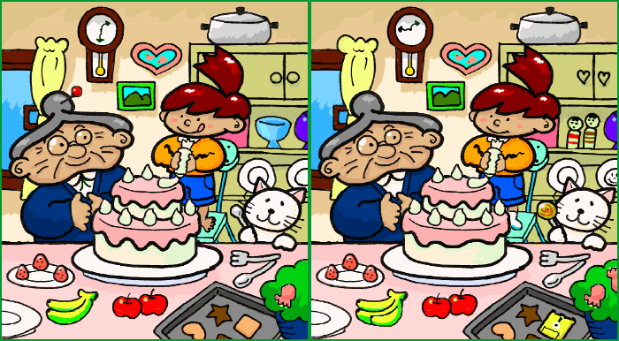
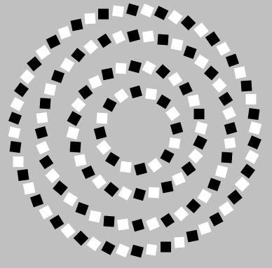
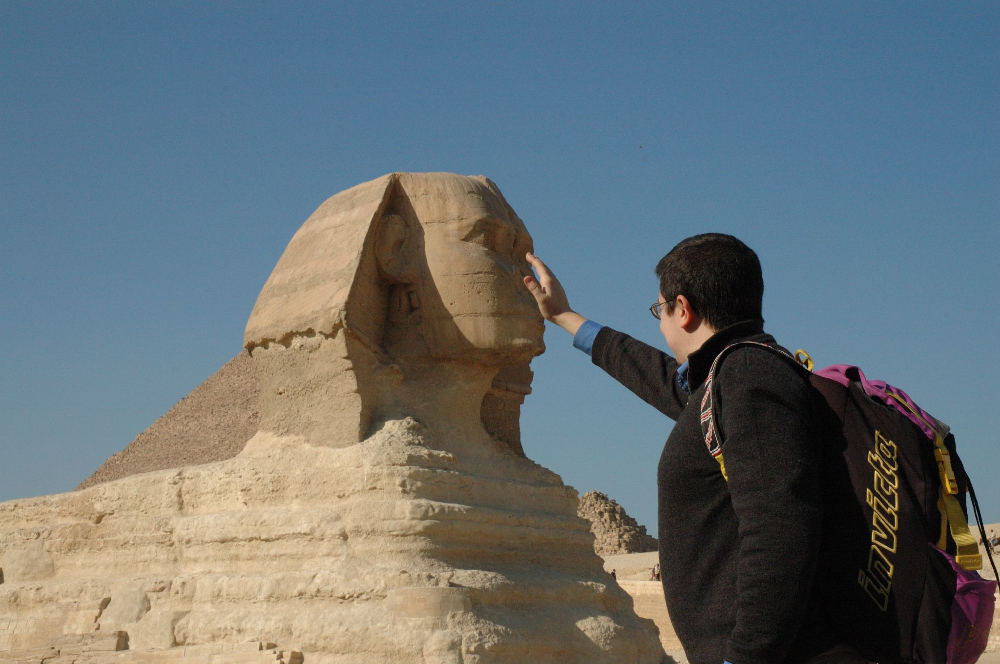
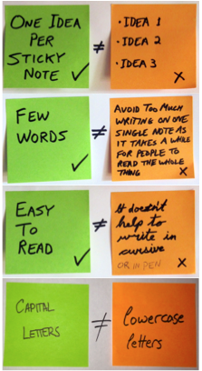

# Closing a mobbing session

## Learning

Learning is fundamentally made up of two parts. The first part is experiences which are the fuel for learning. You need to have experiences to learn from. You've just had an experience of mobbing. This is a great opportunity to learn. Your tank is full of fuel.

However, in and of itself, fuel is not enough to get you anywhere. You need to burn it. The way you harness the potential energy of your experiences is by retrospecting over them, thinking through them, examining them and imagining new experiments for future experiences.

When we finish a mobbing session, we will run a retrospective to help us learn all we can from the session. There are many ways of running a retrospective. We are going to show you the most common way that we use.  

## Basic framework

A basic idea for an observations retrospective is silently collect observations from each participants on sticky notes. The facilitator will then read out each of the observations while placing them on the whiteboard. The facilitator tries to group similar things near each other so that groupings and patterns can emerge.

## The explanation

You want a safe and fertile place in which to gather observations from your group. If the group has never done an observations retrospective before, you will want to take a moment to explain why you are doing this so that people will feel more comfortable and you will get more and better observations.

There are four parts to this explanation that I normally do:

1. Selective attention
2. Expectation biases
3. Single perspective
4. Using sticky notes

### Selective attention

(We usually show this video: youtube search: Selective attention )  
Take a look at these two pictures.   

You might notice a few things that are different. And you might think the things you notice are obvious. But if you have a group write down the things, each one will see things the other one doesn't. No one knows which ones are obvious to them and not obvious to someone else. This is why we ask all your observations, no matter how obvious they are. Everyone misses a lot of things right in front of their eyes.

### Expectation biases

(We usually show this video: youtube search: Faa Baa )  
Look at this picture.   

As you look at the picture, you might notice it moving or that it's spiraling. It is doing neither. However, while many people think of our eyes as cameras and our ears as microphones, what we experience as sight and sound is really put together in the visual and auditory cortexes of our brains. And this is a lot more akin to photoshop.

Our expectations and biases mean that we see and hear things that might not have ever happened. One reason we collect observations is to get the things that happened in front of our eyes that we missed. Another reason is to dispel illusions that we think happened but never did.

### Single perspective

(We usually show this video: youtube search: assumptions)  
Here's another picture.  

What you are seeing is a trick called forced perspective. When you only have one viewpoint, it is easy to be mislead. Everybody is vulnerable to this because everybody experiences things from a single perspective. But we have multiple perspectives in the room when we mob. By taking collective observations, we reduce the chance of being fooled by a single perspective and get a better understanding of the full reality.

### Using sticky notes

On our list of cognitive biases is rationalization. There are many simple things that I have learned long enough ago that I forgot I ever learned them. When faced with knowledge and no memory of acquiring that knowledge, it is rational to assume that I always knew it and that is just another aspect of common sense.

How do you write sticky notes is one such simple task that often falls prey for this rationalization. Here's what you need to know.   

While each of these rules is simple, notice that when taken together the green side is much easier to read than the orange side. And because humans engage in fight or flight responses, most people, when faced with the challenge of reading the orange side, instead choose to skim over or zone out. Following these four simple rules helps to ensure that our observations get read.

> Lazy person fact #6543671283  
You were too lazy to read that number

For sticky notes, it is also important to have good markers to write with. We suggest Sharpies.

<i>Pictures used from Google image search labeled for reuse. The last picture of sticky notes is from Michael Sahota. </i>

## Collecting observations

When you ask for observations, if you just say <i>"give me any observations"</i>, then people get overwhelmed by the vastness of possibilities. Instead, you want to highlight the different areas that observations can come from. Think of this as a spotlight pointing out the different corners so that people will give you a greater quantity and variety of observations. For example, I will often say something like:  

 <i>"Any observations are valid. You can have observations about syntax of the language, the code we used, the IDE and tooling, how we worked as a group, emotions you felt, worries or concerns about the feature, things you liked or disliked. Or things that surprised you about today."</i>

After you ask for observations, you want to give enough time for everyone to write them down. I usually try to count to twenty in my head after I have heard the last person stop writing, just to make sure we got everything.

Collect all the sticky notes and bring them up to the whiteboard. It's time to start reading observations.

## Reading observations

Mainly you are just going to read the observations out loud and place them on the whiteboard to allow for groupings to emerge.

Here are a couple of key things to remember.
  + Use your whole space on the whiteboard or wall.  
  + If you do not have enough space for the amount of stickies, don't worry. Just read them our loud and don't worry about the groupings.
  + If there is any confusion, this is the time to ask for clarification.
  - If you feel there is something to add or compliment or even dispel, you can do that while reading the sticky.
  - If a sticky opens a larger discussion, place it to the side and return to those stickies after going through all the rest.
  - After everything is done, it can be useful to circle and label 3-4 groupings that have emerged.

## Final thoughts

The entire observation period should take 15 minutes on average. It is important to plan for that time as it is easy to run over and skip it if you don't.

If you are mobbing for a full day, we recommend two observations retrospectives, one before lunch and one at the end of the day.

When retrospectives are frequent and short, the outcomes from them are small. But those small outcomes are usually acted upon and problems can be nipped in the bud. When they are long and infrequent, you get big outcomes that are largely ignored.

In your first retrospectives, don't expect a lot of observations. Like everything else, it takes time to build the habit of noticing what is going on. Part of the reason to do regular retrospectives, is to build the metacognition abilities of your team. Once those are built, you might notice people making observations while the mobbing is happening and even writing them down. At this point you might be tempted to abandon the retrospective all together, as it is no longer needed. Don't. If you do, you have to rebuild that skill up after a couple of weeks when the habit fades away.
