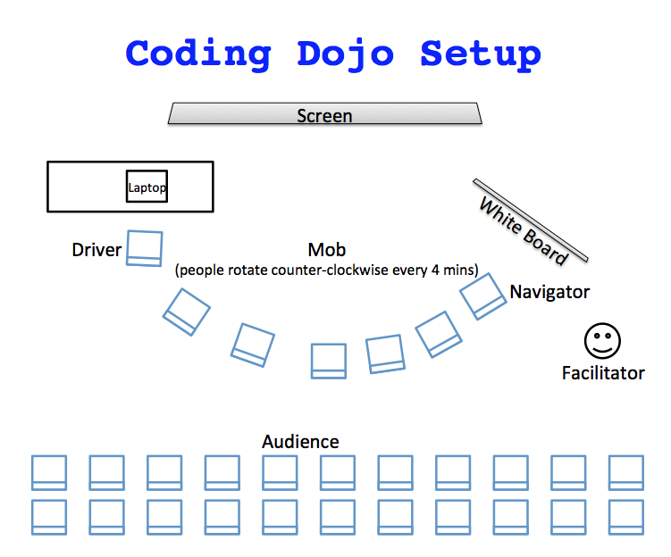

# Mobbing with an audience

Mob makes a great way to do trainings, and hands-on workshops at conferences. While you can scale regular mob programming up to about 20 people, there's some points where it is more convenient to do mobbing with an audience.

## Scaling

Mobbing can scale to about 20 people. But there are lots of pieces to pay attention to.

### Number of rotation cycles

When you are mobbing, you want everyone to get several times times on a computer, a minimum of 2-3. If you take the number of people you have times the number of minutes at the keyboard, you get the total amount of time per cycle. Here's some examples.

| # people | time   | cycle time |
| -------- | ------ | ---------- |
| 6        | 4 mins | 24 mins    |
| 10       | 4 mins | 40 mins    |
| 10       | 2 mins | 20 mins    |
| 15       | 4 mins | 60 mins    |
| 15       | 2 mins | 30 mins    |
| 20       | 4 mins | 80 mins    |
| 20       | 2 mins | 40 mins    |
| 20       | 1 mins | 20 mins    |

The next question is how much time you have. If you are doing an all day training, 1,5 hours cycle time is fine. Everyone will still get 4-5 chances at the keyboard. If you are doing a 1,5 hour conference session, you need a smaller mob.

### Rotating on event

Training and conferences also mean that you may be doing work that is a little more understood by the facilitator. This offers the opportunity to rotate on something other than time. When event-based rotation keeps you within an average of four minute rotation time, I prefer it as a method of rotation. It is satisfying to rotate on accomplishment.

Here are some events that I will use for rotation:

   1. Unit test is written
   2. Unit test is passing
   3. Small task is completed
   4. Single line of code is written
   5. Story (example) is written on a board

> When teaching kids in Africa, we had 30 students on a single computer. We rotated on single line of code written. This allowed everyone to get a couple chances at the computer, even in a short two hour session.

## Audience

Sometimes scaling the mob doesn't work or give the experience you want for the size of the group in the time you have. In these cases, we recommend having a mob with an audience.

To the main part, this works the same part as a regular mob, with a couple extra rules.

  1. People can join or leave the mob at will.
  2. When joining, sit right behind the driver.
  3. The audience can also volunteer insights and information to the navigator.
  4. Audience participates in retrospectives.

  If the audience is volunteering too much information, so that the navigator does not get a chance to get their focus and flow, quiet them down to give the navigator a chance. Sometimes loud audience members are a sign of people who need to be invited to join the mob.

  On the other hand, if the navigator is stuck or frightened, you may need to encourage the audience to help them out.

### Diversity in the mob

  When you have a subsection of your audience, the makeup of the mob will effect how and what they will do. The people who feel more comfortable volunteering, will volunteer first. Since you're only selecting a small group, you might have to encourage minorities to join in front or your mob will not reflect your audience but will be entirely made up of the most common majority.

  There are different types of diversity. Sometimes you may need to encourage programmers without experience in the particular language, non-programmers, different roles, different experience levels, different ethnicities, or different genders. The more diversity you get in the mob, the more the audience can connect, feel safe to join and the better your session will go.
