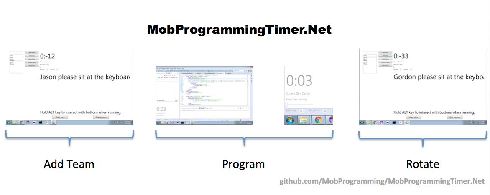

# Full team engagement

When you're learning to mob, you need to have a designated navigator so that you can learn the skill of how to talk. If you don't do this, you will naturally isolate the more quiet people in your team. Then they will not learn to express themselves and not be able to keep up. Once you learn how communicate your ideas on tasks and code to another person you want to move from a single navigator to an entire team contributing at the same time.

Here are some of the changes to introduce as you move towards full team engagement.

## No designated navigator

This means that you don't need someone standing up while they're doing navigation. The only position that is actually relevant is the driver. This is a very short period of transition and after a little bit of that I will introduce...

## The mob timer

The mob timer is a program that not only tracks the amount of time, but also who is supposed to be at the keyboard. Once you have a mob timer, you no longer need to rotate seats. And when you don't rotate seats, the concept of the designated navigator becomes even more blurry. This frees everybody to focus on the code instead of their turn.

Here are a few mob timers:

http://oss.jahed.io/agility/timer.html  
Web-based, no install needed  
Can't see while programming

https://github.com/MobProgramming/MobProgrammingTimer.Net/releases  
Windows  
Hard UI; Full-screen forces rotation

https://github.com/GreatWebGuy/MobTime/releases  
Windows & Mac  
Easy to see countdown; Easy to pause.

https://github.com/MobProgramming/MobTimer.Python/releases  
Windows & Mac  
Full-screen forces rotation; Easy to see countdown

## Encouraging participation

Deciding which way to go
Too abstract
Walking away

## Holding the space
