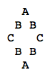

# Katas

## FizzBuzz
1,2,Fizz,4,Buzz,Fizz,7,8,Fizz,Buzz,11,Fizz,13,14,FizzBuzz  
Print the numbers from 1-100 replacing numbers divisible  by 3 with Fizz, divisible by 5 with Buzz and both with FizzBuzz.

## Roman Numerals

  1. Given a number, convert in to a roman numeral.
  2. Given a roman numeral, convert it to a number.
  3. Program roman numeral addition, without allowing to convert to numbers in between.

## Games

  Most games make for good katas. Here are a few of our favorites
  1. Tic-Tac-Toe
  2. Battleship
  3. Minesweeper
  4. Bowling (score card)
  5. Blackjack
  6. Checkers/Chess
  7. Yahtzee
  8. Scrabble

## Checkouts

 Create a receipt and checkout program. Interesting pricing rules include
 1. Multiple items
 2. Discounts if 3 are purchased
 3. Discounts if 3 or more are purchased
 4. Weighable items (3.5 pounds of candy)
 5. Rates per ranges (0-1 lbs $5/lbs, 1-10 lbs $4per lbs, 10+ 3$ per pound)
 6. Taxable items
 7. Buy on get on free promotions
 8. Combo Promotions ($5 off hotdogs & buns)

## Math

  Math problems are also fun.
  1. Triangles (primeters, area, angles)
  2. Shortest route
  3. Integer Range (does 1-100 contain 65? overlap 50-200? contain 5-10?)
  4. Prime Factors
  5. Change Machine (which coin combinations to give for 55 cents)
  6. Game of Life
  7. Leap Year

## Words / Text

 1. Anagrams
 2. Secret Decoder Ring
 3. Word Wrap
 4. LCD numbers
 5. Natural Sort (1.txt,2.txt,10.txt,20.txt)
 5. Diamonds  
 

## Other
  Any suggestion can make a good kata. Our rule is whoever suggested the kata becomes the product owner and is responsible for defining the user stories and prioritizing them.
